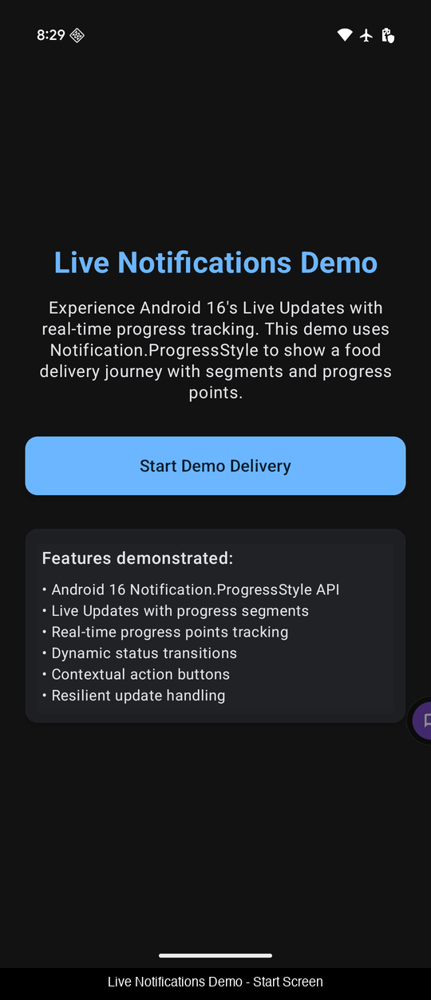

# Live Notifications Demo - Android 16 Live Updates

A comprehensive demonstration of Android 16's Live Updates feature using the new `Notification.ProgressStyle` API. This project showcases real-time delivery tracking with dynamic progress segments, contextual actions, and seamless notification-based user experiences.

## 🎬 Demo



*Complete demo showing real-time delivery tracking with Android 16 Live Updates*

## ✨ Features

🚚 **Real-time Progress Tracking** - Dynamic notification segments that update automatically  
📱 **Modern Jetpack Compose UI** - Clean, responsive interface built with Compose  
🔔 **Smart Notification Management** - Contextual actions that adapt to delivery phases  
⚡ **Robust Error Handling** - Network failure simulation and retry logic  
🔄 **Lifecycle-Aware Service** - Proper foreground service with automatic termination  
🎯 **Version Compatibility** - Graceful fallback for pre-Android 16 devices  

## 🎯 Live Updates API Highlights

- **Dynamic Progress Segments**: Color-coded stages (Confirmed → Preparing → En Route → Delivered)
- **Real-time ETA Updates**: Time estimates that adjust as delivery progresses
- **Contextual Action Buttons**: Actions change per phase ("Modify Order" → "Track Driver" → "Call Driver")
- **Progress Tracker Icon**: Visual delivery truck indicator showing current position
- **Automatic Lifecycle Management**: Service stops and dismisses notifications on completion

## 📋 Requirements

- **Target SDK**: Android 16 (API 36)
- **Minimum SDK**: Android 9 (API 28)  
- **Android Studio**: Meerkat 2024.3.1 or higher
- **Kotlin**: 1.9.0 or later
- **Device/Emulator**: Android 16 for full Live Updates experience

## 🚀 Quick Start

1. **Clone the repository**
   ```bash
   git clone https://github.com/iVamsi/Live-Notifications-Demo.git
   cd Live-Notifications-Demo
   ```

2. **Open in Android Studio**
   - Launch Android Studio Meerkat (2024.3.1+)
   - Open the project directory
   - Wait for Gradle sync to complete

3. **Build and Run**
   - Connect an Android 16 device or start an Android 16 emulator
   - Click Run or press `Ctrl+R` (Windows/Linux) / `Cmd+R` (macOS)

4. **Experience Live Updates**
   - Tap "Start Demo Delivery" to begin the demonstration
   - Grant notification permission when prompted
   - Pull down the notification panel to see Live Updates in action
   - Watch as progress segments, ETA, and actions update automatically

## 🏗️ Architecture

### Core Components

- **MainActivity**: Jetpack Compose UI with permission handling and delivery state management
- **DeliveryTrackingService**: LifecycleService managing Live Updates with coroutine-based updates
- **LiveUpdatesNotificationBuilder**: Android 16 `Notification.ProgressStyle` implementation
- **NotificationHelper**: Unified notification management with version compatibility
- **DeliveryStatus**: Enum-based status model with built-in progress calculations

### Technology Stack

- **UI Layer**: Jetpack Compose with Material Design 3
- **Service Layer**: LifecycleService for coroutine-aware background processing
- **Notification Layer**: Android 16 `Notification.ProgressStyle` API
- **State Management**: SharedPreferences for delivery completion tracking
- **Concurrency**: Kotlin Coroutines with structured concurrency

## 📱 Live Updates Implementation

### Progress Segments
```kotlin
private fun createDeliverySegments(currentStatus: DeliveryStatus): List<Notification.ProgressStyle.Segment> {
    val allStatuses = DeliveryStatus.getAllStatuses()
    val currentIndex = allStatuses.indexOf(currentStatus)

    return allStatuses.mapIndexed { index, status ->
        val segmentColor = when {
            index < currentIndex -> getColor(R.color.status_delivered) // Completed
            index == currentIndex -> getColor(status.colorRes) // Current
            else -> Color.GRAY // Pending
        }

        Notification.ProgressStyle.Segment(100).setColor(segmentColor)
    }
}
```

### Real-time Updates
```kotlin
private suspend fun simulateDeliveryJourney() {
    val statuses = DeliveryStatus.getAllStatuses()

    for (status in statuses) {
        currentStatus = status
        
        for (pointIndex in status.progressPoints.indices) {
            val currentProgress = DeliveryStatus.calculateProgress(status, pointIndex)
            updateLiveNotificationWithRetry(status, currentProgress)
            delay(SEGMENT_UPDATE_DELAY_MS)
        }
        
        if (status != DeliveryStatus.DELIVERED) {
            delay(STATUS_TRANSITION_DELAY_MS)
        }
    }
}
```

## 🔧 Configuration

### Delivery Timing
Customize update intervals in `DeliveryTrackingService`:

```kotlin
companion object {
    private const val SEGMENT_UPDATE_DELAY_MS = 3000L // 3 seconds between progress points
    private const val STATUS_TRANSITION_DELAY_MS = 6000L // 6 seconds between status changes
}
```

### Status Definitions
Modify delivery stages in `DeliveryStatus.kt`:

```kotlin
enum class DeliveryStatus(
    val displayName: String,
    val description: String,
    val estimatedMinutes: Int,
    val segmentLength: Int,
    val progressPoints: List<Int>
) {
    CONFIRMED("Order Confirmed", "Your order has been confirmed", 25, 100, listOf(25, 50, 75, 100)),
    PREPARING("Preparing Your Order", "Our kitchen team is preparing your meal", 15, 150, listOf(50, 100, 150)),
    // ... add more statuses as needed
}
```

## 🧪 Testing

The project includes comprehensive testing:

- **Unit Tests**: Notification building and status progression logic
- **Integration Tests**: Service lifecycle and Live Updates functionality
- **UI Tests**: Compose interface and user interactions

Run tests with:
```bash
./gradlew test
./gradlew connectedAndroidTest
```

## 📊 Performance Considerations

- **Battery Optimization**: Intelligent update intervals based on delivery phase
- **Network Efficiency**: Retry logic with exponential backoff
- **Memory Management**: Proper service lifecycle and cleanup
- **Compatibility**: Graceful fallback for older Android versions

## 🎨 Customization

### Colors
Update delivery status colors in `res/values/colors.xml`:
```xml
<color name="status_confirmed">#4CAF50</color>    <!-- Green -->
<color name="status_preparing">#FF9800</color>    <!-- Orange -->
<color name="status_en_route">#2196F3</color>     <!-- Blue -->
<color name="status_delivered">#9C27B0</color>    <!-- Purple -->
```

### Icons
Replace notification icons in `res/drawable/`:
- `ic_delivery_tracker.xml` - Progress tracker icon
- `ic_order_confirmed.xml` - Order confirmed icon
- `ic_preparing.xml` - Preparing status icon
- `ic_en_route.xml` - En route status icon
- `ic_delivered.xml` - Delivered status icon

## 🤝 Contributing

Contributions are welcome! Please feel free to:

1. Fork the repository
2. Create a feature branch (`git checkout -b feature/amazing-feature`)
3. Commit your changes (`git commit -m 'Add amazing feature'`)
4. Push to the branch (`git push origin feature/amazing-feature`)
5. Open a Pull Request

## 🐛 Issues

Found a bug or have a feature request? Please open an issue on GitHub with:

- **Bug Reports**: Steps to reproduce, expected behavior, actual behavior, and device info
- **Feature Requests**: Detailed description of the proposed feature and use case
- **Questions**: General questions about Live Updates implementation

## 📄 License

This project is licensed under the MIT License - see the [LICENSE](LICENSE) file for details.

## 🙏 Acknowledgments

- Android team for the amazing Live Updates API
- Material Design team for the beautiful design system
- Jetpack Compose team for the modern UI toolkit

---

**Perfect for developers implementing**: Food delivery apps, rideshare tracking, package delivery, fitness tracking, or any progress-centric applications requiring real-time user updates.